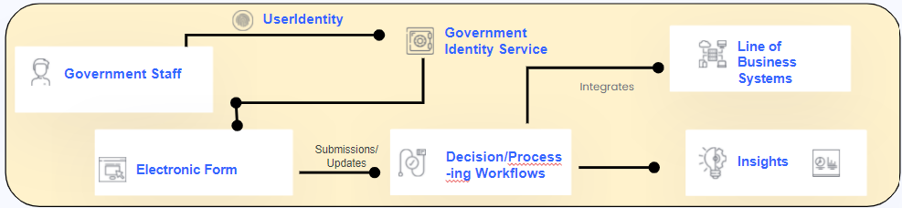
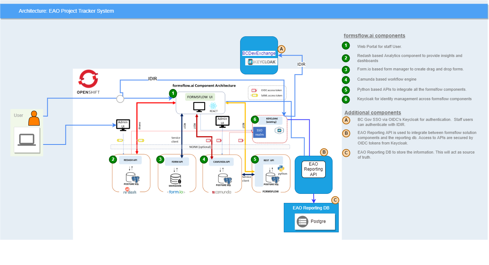

# EAO Project Tracker 
Environment Assessment Office Project Tracker
 
## Solution Objectives
Prototype a modern and digital project tracker, compliance and enforcement tool using low code and open source solution.

>Determine the value an feasibility of this solution.

## Solution Constraints
| Nbr  | Constraints |
| :---:| :--- |
| 1  | The solution should be deployed in Openshift environment  |
| 2  | The solution should use low code tehnology stack  |
| 3  | The solution should use open source technologies  |

## Solution

Use [formsflow.ai](https://github.com/AOT-Technologies/forms-flow-ai) which is a completely free and open-source framework that integrates intelligent forms, decision making workflows, and powerful analytics.

### Solution Components
Here is a snapshot of various solution components for this solution

| Nbr  | Component | Description |
| :---:| :---: |:--- |
| 1  | Staff  | The users who access the system for faily work. |
| 2  | Identity Service  | Service that provides authentication and authorization for staff identity. |
| 3  | Electronics form | Provides the capability to create online forms quickly and easily with an intuitive low code form designer with advanced capabilities including data validation, conditional fields, file uploads, and signatures.|
| 4  | Decisions/Processing Workflows| Provides the capability to design and deploy automated and human-centric workflows.|
| 5  | Insights  |Provides the capability to visualize data relevant with customizable dashboards. Track submission metrics and derive insights from submitted form data.|
| 6  | Line of Business Systems  | These are the internal systems of the organization that is either created as part of the solution or solution integrate.|

### Solution Architecture 
Here is the overall architecture for the solution

### formsflow.ai components
This solution make use the full set of components provided by [formsflow.ai](https://github.com/AOT-Technologies/forms-flow-ai)
| Nbr  | Component | Description |
| :---:| :---: |:--- |
| 1  | Web  | Web Portal for staff. |
| 2  | Analytics  | [Redash](https://redash.io/) based Analytics component to provide insights and dashboards. |
| 3  | Electronics form | [Form.io](https://www.form.io/) based form manager that provides the capability to create online forms quickly and easily with an intuitive low code form designer with advanced capabilities including data validation, conditional fields, file uploads, and signatures.|
| 4  | BPM| [Camunda](https://camunda.com/) based process automation engine that provides the capability to design and deploy automated and human-centric workflows.|
| 5  | APIs  | [Python](https://www.python.org/) based APis integrate all other components with in the [formsflow.ai](https://github.com/AOT-Technologies/forms-flow-ai).|
| 6  | Identity Service  | [Keycloak](https://www.keycloak.org/) for identity management and SSO across [formsflow.ai](https://github.com/AOT-Technologies/forms-flow-ai) components.|

### Additional Components
| Nbr  | Component | Description |
| :---:| :---: |:--- |
| A  | IDIR Identity Servuce  | BC Gov SSO via OIDC's Keycloak for authentication.  Staff users can authenticate with IDIR. |
| B  | EAO Reporting API  | Python](https://www.python.org/) based APis used to integrate between [formsflow.ai](https://github.com/AOT-Technologies/forms-flow-ai) solution components and the reporting db. Access to APIs are secured by OIDC tokens from [Keycloak](https://www.keycloak.org/). |
| C  | Central Database | [PostgreSQL](https://www.postgresql.org/) based database store information.|

## Technologies Overview

### formsflow.ai
Use [formsflow.ai](https://github.com/AOT-Technologies/forms-flow-ai) which is a completely free and open-source framework that integrates intelligent forms, decision making workflows, and powerful analytics as the core solutoin component. This will be further customized and extended to meet the prototype requiremnts.

### Central Database
PostgreSQL is used as central database for the project due to the large adoption on BC Gov projects. 

> This decision is only applicable to the additional solution components. [formsflow.ai](https://github.com/AOT-Technologies/forms-flow-ai) comes with its own set of databases. 

### APIs
Python was selected as the technology to develop APIs required for integration between formsflow and additional solution components.

### Staff Identity
BC Govt uses IDIR as the identity for their staff. BCdevexchange already setup a Keycloak to provide IDIR based authentication for SSO. The Keycloak instance installed as part of [formsflow.ai](https://github.com/AOT-Technologies/forms-flow-ai) is updated to add BCdevexchange Keycloak instane as a *Identity Provider*.

